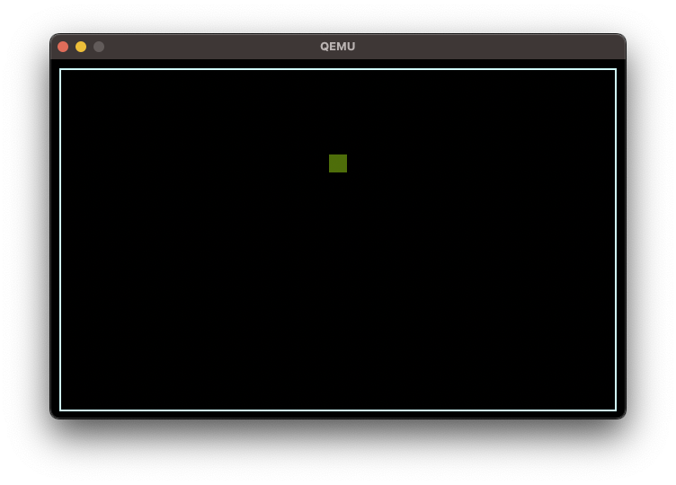

# SnakeOS

## The classic game of snake on a custom OS.

SnakeOS boots a small homemade 32-bit operating system (Stripped version of SimpleOS) and runs the classic game of snake.

No libraries, using mode 13h, 320x200, to access the VGA in a linear fashion.

Status: work in progress.
    - Draw border.
    - Draw square
    - Double buffering (copy from offscreen buffer to video buffer)
    - blit
    - Square travels down the screen.

